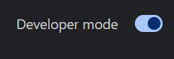
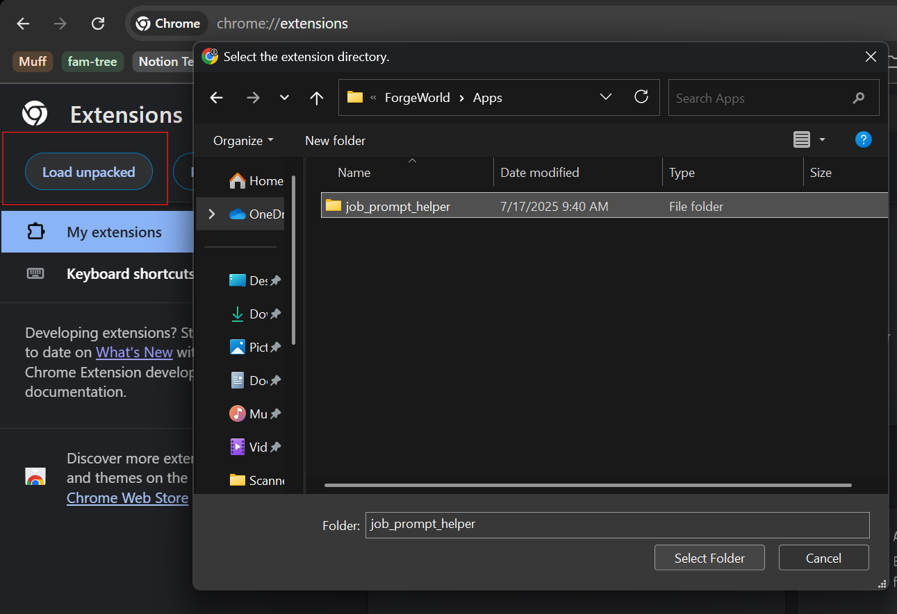
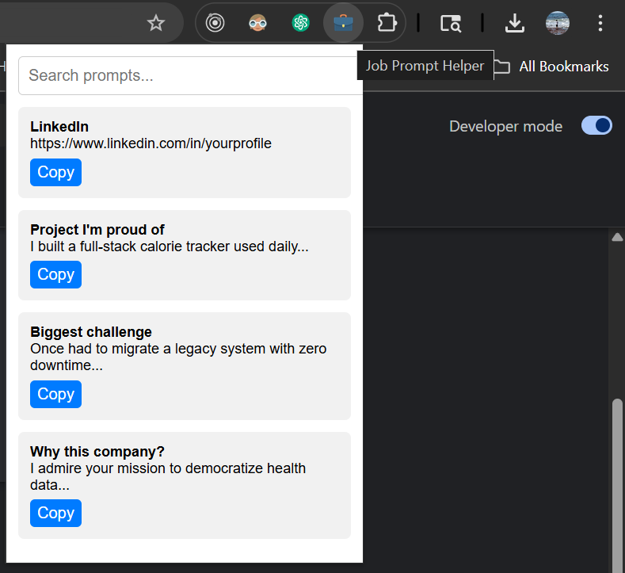

# Job Prompt Helper 🚀

A Chrome extension that helps you quickly access and copy common job application responses and personal information with a persistent floating panel.

## ✨ Features

- **Persistent Floating Panel**: Stays open while you work - won't close when clicking outside
- **Quick Access**: Instantly find and copy job application answers
- **Search Functionality**: Filter through prompts by typing keywords
- **One-Click Copy**: Copy responses directly to your clipboard
- **Auto-Focus**: Search input automatically focused when panel opens
- **Auto-Copy**: Press Enter when only one result shows to auto-copy and close
- **Keyboard Shortcuts**: `Ctrl+Shift+J` to toggle the panel
- **Personal Information**: Store and access your contact details, social links, and addresses
- **Interview Responses**: Pre-written answers for common interview questions
- **Easy Data Management**: Built-in settings page to edit your prompts

## 🎯 Quick Start

1. **Install the extension** (see Installation section below)
2. **Customize your data** (see Data Management section below)
3. **Go to any webpage** (like a job application site)
4. **Press `Ctrl+Shift+J`** (or `Cmd+Shift+J` on Mac)
5. **Start typing** to search for prompts
6. **Press Enter** when only one result shows to auto-copy
7. **Or click any "Copy" button** for manual copying

## 📋 Included Prompts

### Personal Information
- LinkedIn profile URL
- GitHub profile URL
- Personal website
- Email address
- Phone number
- Address (short and full formats)
- City, State, and Zip
- Country, Date of Birth, Gender, Nationality

### Interview Responses
- Project you're proud of
- Biggest challenge overcome
- Why you want to work at the company
- Biggest weakness
- Biggest strength

## 🚀 Installation

### Method 1: Load Unpacked Extension

1. **Open Chrome Extensions**
   - Navigate to `chrome://extensions/`
   - Or go to Chrome Menu → More Tools → Extensions

2. **Enable Developer Mode**
   - Toggle the "Developer mode" switch in the top-right corner
   

3. **Load the Extension**
   - Click "Load unpacked" button
   - Select the `job_prompt_helper` folder
   

4. **Customize Your Data** (see Data Management section below)

5. **Start Using**
   - The extension icon will appear in your Chrome toolbar
   - Click the icon to open the popup version
   - Or use `Ctrl+Shift+J` for the floating panel
   

### Method 2: Chrome Web Store (Coming Soon)

The extension will be available on the Chrome Web Store for easy installation.

## 🎯 How to Use

### Floating Panel (Recommended)
1. **Press `Ctrl+Shift+J`** anywhere on any webpage
2. **Panel appears** in the top-right corner with search focused
3. **Type to search** - results filter in real-time
4. **Press Enter** when only one result shows to auto-copy and close
5. **Or click "Copy"** for manual copying
6. **Click the X** or press `Ctrl+Shift+J` again to close

### Popup Version
1. **Click the Extension Icon** in your Chrome toolbar
2. **Search for Prompts** by typing in the search box
3. **Copy Responses** by clicking the "Copy" button
4. **Click the ⚙️ icon** to access settings

### DevTools Panel
1. **Open DevTools** (F12)
2. **Look for "Job Prompts" tab**
3. **Use the same search and copy functionality**

## ⌨️ Keyboard Shortcuts

- **`Ctrl+Shift+J`** (Windows/Linux) or **`Cmd+Shift+J`** (Mac)
  - Toggle the floating panel
  - Auto-focuses the search input
  - Works on any webpage

## 📊 Data Management

### Setting Up Your Personal Data

#### Option 1: Built-in Settings Page (Recommended)
1. **Click the extension icon** in your Chrome toolbar
2. **Click the ⚙️ settings icon** in the popup header
3. **Edit your prompts** in the settings page:
   - Change labels and text for each prompt
   - Add new prompts with the "+ Add New Prompt" button
   - Reorder prompts using the up/down arrows
   - Delete prompts you don't need
4. **Click "Save All Changes"** to save your data
5. **Your data is stored securely** in Chrome's local storage

#### Option 2: Manual File Editing
1. **Copy the example file**:
   ```bash
   cp data/prompts.example.js data/prompts.js
   ```

2. **Edit `data/prompts.js`** with your personal information:
   ```javascript
   export const prompts = [
     // Personal Information
     { label: "LinkedIn", text: "https://www.linkedin.com/in/yourprofile" },
     { label: "GitHub", text: "https://github.com/yourprofile" },
     { label: "Email", text: "yourname@yourwebsite.com" },
     // ... customize all your personal data
   ];
   ```

3. **Reload the extension** in Chrome

### Data Security

- **Your personal data is stored locally** in Chrome's extension storage
- **No data is sent to external servers** - everything stays on your device
- **Settings page data is private** and only accessible to you
- **Manual file editing** keeps data in your control

### Adding Custom Prompts

#### Via Settings Page:
1. Click the "⚙️" settings icon in the popup
2. Click "+ Add New Prompt"
3. Enter your label and text
4. Click "Save All Changes"

#### Via File Editing:
Edit `data/prompts.js` to add your own prompts:
```javascript
{ label: "Your Custom Prompt", text: "Your custom response text" }
```

## 📁 File Structure

```
job_prompt_helper/
├── manifest.json              # Extension configuration
├── background.js              # Background service worker
├── style.css                  # Global styling
├── README.md                  # Documentation
├── .gitignore                 # Git ignore rules
├── src/                       # Source code
│   ├── popup/                 # Popup interface
│   │   ├── popup.html        # Popup HTML
│   │   └── popup.js          # Popup functionality
│   ├── panel/                 # DevTools panel
│   │   ├── panel.html        # Panel HTML
│   │   └── panel.js          # Panel functionality
│   ├── devtools/              # DevTools integration
│   │   ├── devtools.html     # DevTools page
│   │   └── devtools.js       # DevTools panel creation
│   ├── content/               # Content scripts
│   │   └── content.js         # Floating panel functionality
│   └── settings/              # Settings interface
│       ├── settings.html      # Settings page
│       └── settings.js        # Settings functionality
├── data/                      # Data files
│   ├── prompts.js            # Your personal data (gitignored)
│   └── prompts.example.js    # Example data template
└── assets/                    # Images and icons
    ├── icon.png
    ├── extension_demo.png
    ├── load_unpacked.png
    └── toggled_dev_mode.png
```

## 🔧 Technical Details

- **Manifest Version**: 3
- **Permissions**: Storage access for user data
- **Browser Support**: Chrome and Chromium-based browsers
- **File Size**: Lightweight (< 1MB)
- **Content Scripts**: Runs on all websites for floating panel
- **DevTools Integration**: Optional persistent panel
- **Data Management**: Local storage with settings interface
- **Security**: All data stored locally, no external servers

## 🤝 Contributing

1. Fork the repository
2. Create a feature branch
3. Make your changes
4. Test the extension
5. Submit a pull request

## 📝 License

This project is open source and available under the [MIT License](LICENSE).

## 🐛 Issues & Support

If you encounter any issues or have suggestions for improvements:
- Open an issue on GitHub
- Include browser version and steps to reproduce
- Provide screenshots if applicable

---

**Made with ❤️ for job seekers everywhere**

